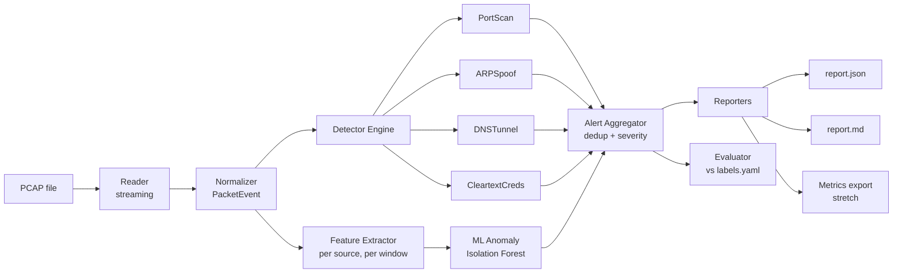

# Architecture: PcapSentinel

Companion to `PRD.md`. Describes how the system is structured, how data flows, and how each detector works.

---

## 1. Design Principles

1. **Streaming first:** never hold the full capture in memory.
2. **Explainable by default:** every alert carries the evidence that triggered it.
3. **Plugin-style detectors:** a new detector is one class; the core doesn't change.
4. **Config over code:** thresholds live in YAML, not in source.
5. **Measurable:** the evaluation harness is a first-class component, not an afterthought.
6. **Safe by design:** secrets are redacted at the source, before they reach any output.

## 2. High-Level Pipeline



Each packet flows once through the reader and normalizer, then is dispatched to every registered detector. Detectors keep their own bounded state and emit alerts when thresholds trip. The aggregator merges duplicates and hands the final alert list to the reporters and the evaluator.

## 3. Repository Layout

```
pcapsentinel/
├── pcapsentinel/
│   ├── __init__.py
│   ├── cli.py                # argparse/typer entry point (analyze, evaluate, train)
│   ├── config.py             # load + validate YAML, merge CLI overrides
│   ├── models.py             # PacketEvent, Alert, Severity dataclasses
│   ├── reader.py             # streaming pcap reader (wraps Scapy PcapReader)
│   ├── normalizer.py         # raw packet -> PacketEvent
│   ├── engine.py             # registers detectors, dispatches events
│   ├── detectors/
│   │   ├── base.py           # Detector abstract base class
│   │   ├── port_scan.py
│   │   ├── arp_spoof.py
│   │   ├── dns_tunnel.py
│   │   └── cleartext_creds.py
│   ├── ml/
│   │   ├── features.py       # windowed per-source feature extraction
│   │   ├── train.py          # fit + save Isolation Forest
│   │   └── infer.py          # load model, score sources
│   ├── aggregator.py         # dedup, merge, severity assignment
│   ├── reporters/
│   │   ├── json_reporter.py
│   │   ├── markdown_reporter.py
│   │   └── metrics_exporter.py   # stretch: Graphite/Prometheus text
│   └── evaluation/
│       ├── labels.py         # parse labels.yaml
│       └── evaluate.py       # precision / recall / F1 / FP counts
├── configs/default.yaml
├── data/
│   ├── lab_captures/         # generated in VM lab (not committed if large)
│   └── labels.yaml
├── scripts/
│   └── lab_generate.md       # documented lab commands and setup
├── tests/
│   ├── synthetic/            # tiny hand-built pcaps
│   └── test_*.py
├── docs/                     # PRD.md, ARCHITECTURE.md, sample report
├── requirements.txt
└── README.md
```

## 4. Core Data Models

```python
@dataclass(frozen=True)
class PacketEvent:
    ts: float                 # epoch seconds
    src_ip: str | None
    dst_ip: str | None
    src_mac: str | None
    dst_mac: str | None
    proto: str                # "TCP" | "UDP" | "ARP" | "ICMP" | "OTHER"
    src_port: int | None
    dst_port: int | None
    tcp_flags: str | None     # e.g. "S", "SA", "F", "" (NULL), "FPU" (Xmas)
    length: int
    app: dict                 # parsed app-layer hints: dns_qname, http_auth, ftp_cmd...

@dataclass
class Alert:
    id: str
    detector: str             # "port_scan" | "arp_spoof" | ...
    severity: Severity        # LOW | MEDIUM | HIGH
    src: str
    dst: str | None
    start_ts: float
    end_ts: float
    score: float              # 0..1 confidence or anomaly score
    summary: str
    evidence: dict            # counts, sample ports, entropy values (redacted)
```

## 5. Detector Interface

```python
class Detector(ABC):
    name: str

    def __init__(self, cfg: dict): ...

    @abstractmethod
    def process(self, ev: PacketEvent) -> list[Alert]:
        """Update internal state; return any newly triggered alerts."""

    def finalize(self) -> list[Alert]:
        """Called at end of stream to flush pending state."""
        return []
```

The engine calls `process()` for each event and `finalize()` once at the end. State is per-detector and TTL-evicted to keep memory bounded.

## 6. Detector Designs

Thresholds below are **starting values to tune** using the evaluation harness, not fixed truths.

### 6.1 Port Scan
- **State:** for each source IP, a sliding time window of `(dst_ip, dst_port, flags)` tuples.
- **Trigger:** distinct destination ports (or hosts) from one source exceeds `N` within `T` seconds, with mostly unanswered or reset probes.
- **Classification by flags:**
  - SYN only, no follow-up ACK → SYN scan (half-open)
  - No flags → NULL scan
  - FIN only → FIN scan
  - FIN+PSH+URG → Xmas scan
- **Evidence:** distinct port count, sample ports, scan type, rate (ports/sec).
- **Known weakness:** slow scans (`nmap -T1`) fall below the rate threshold. Evaluated and documented; a longer secondary window can partly mitigate this.

### 6.2 ARP Spoofing
- **State:** map `IP -> set(MAC)` with first-seen timestamps.
- **Trigger:** an IP acquires a second MAC, or a gratuitous/unsolicited ARP reply changes an existing binding.
- **Filtering to reduce false positives:** allow configured known-duplicate cases (e.g., VRRP/HSRP virtual MACs, DHCP renewals) via an allowlist.

### 6.3 DNS Tunneling
- **Signals (combined into a score):**
  - Subdomain label length above a cutoff
  - Shannon entropy of the queried name above a cutoff
  - Number of unique subdomains queried under one parent domain within a window
  - Unusual proportion of TXT / NULL queries
- **Trigger:** score above a configured threshold for a (source, parent domain) pair.
- **Allowlist:** common CDN/telemetry domains that legitimately produce long random labels.

### 6.4 Cleartext Credentials
- **HTTP:** parse `Authorization: Basic` headers on non-TLS traffic.
- **FTP:** track `USER` and `PASS` commands on port 21 sessions.
- **Redaction:** the username may be shown; the password and any secret material are **replaced with a fixed mask at parse time** and never stored in `PacketEvent`, `Alert`, or reports.
- **Severity:** always at least MEDIUM, since it is a confirmed insecure practice rather than a probabilistic signal.

### 6.5 ML Anomaly Detector (optional)
- **Windowing:** fixed windows (e.g., 60 s) per source IP.
- **Features (per source, per window):** connections/min, distinct destination IPs, distinct destination ports, SYN count, SYN-to-ACK ratio, bytes in/out ratio, mean packet size, DNS query rate.
- **Model:** Isolation Forest trained on **benign baseline captures** from the lab; contamination is tuned, not assumed.
- **Output:** anomaly score per (source, window), top-K reported as alerts with the contributing features.
- **Comparison:** run against the same labeled captures as the rules and report where each approach wins or fails.

## 7. State Management and Memory Bounds

- Every detector stores state in dictionaries keyed by source (or IP/domain) with a `last_seen` timestamp.
- The engine triggers a periodic sweep (based on packet timestamps, not wall clock) that evicts entries idle longer than `state_ttl`.
- Hard cap (`max_tracked_sources`) drops the oldest entries and logs a warning in the report, so behavior under attack traffic volume is visible rather than silent.

## 8. Alert Aggregation

- **Dedup key:** `(detector, src, dst, scan_type/domain)`.
- Alerts with the same key whose time ranges overlap or fall within a merge gap are merged into one with expanded evidence.
- **Severity:** derived from score and detector-specific rules (e.g., cleartext creds ≥ MEDIUM, ARP spoof with multiple flips = HIGH).
- Output is sorted by severity, then score.

## 9. Reporting

| Output | Contents |
|---|---|
| `report.json` | Capture stats, config used, all alerts with full evidence (machine-readable) |
| `report.md` | Summary table, top offending sources, per-alert evidence, malformed-packet count, known limitations |
| Metrics (stretch) | Alert counts by detector/severity in Graphite plaintext or Prometheus text, for Grafana |

## 10. Evaluation Harness

**labels.yaml (example shape):**

```yaml
- capture: lab_captures/syn_scan_01.pcap
  expected:
    - detector: port_scan
      scan_type: syn
      src: 192.168.56.10
      start: 12.0
      end: 25.0
- capture: lab_captures/benign_01.pcap
  expected: []
```

**Matching rule:** an alert is a true positive if detector, source, and overlapping time range match a label; unmatched alerts are false positives; unmatched labels are false negatives.

**Output:** per-detector table of TP / FP / FN, precision, recall, F1. Results are split between a **tuning set** and a **held-out set** to avoid overfitting thresholds.

## 11. Configuration (excerpt)

```yaml
window_seconds: 30
state_ttl_seconds: 300
max_tracked_sources: 50000

port_scan:
  min_distinct_ports: 20
  window_seconds: 10
  slow_window_seconds: 300
  slow_min_distinct_ports: 40

arp_spoof:
  allowlist_macs: []

dns_tunnel:
  max_label_length: 40
  min_entropy: 3.5
  min_unique_subdomains: 30
  domain_allowlist: []

ml:
  enabled: false
  model_path: models/iforest.joblib
  top_k: 10
```

## 12. Testing Strategy

| Level | Approach |
|---|---|
| Unit | Each detector fed hand-built `PacketEvent` sequences (trigger and no-trigger cases) |
| Synthetic pcaps | Small pcaps built with Scapy for every scenario, including edge cases |
| Integration | Full `analyze` run on lab captures; compare to expected alert counts |
| Regression | Evaluation scores tracked in CI so threshold changes can't silently degrade results |
| Robustness | Truncated/corrupt pcap and empty file must not crash |

## 13. Security and Ethics

- Attack traffic is generated **only** in an isolated, host-only VM network on machines I own.
- No credentials, payloads, or personal data are written to reports.
- Sample third-party pcaps are used per their terms and are not redistributed if licensing is unclear.
- README states the tool is for education and authorized testing.

## 14. Technology Choices

| Concern | Choice | Rationale |
|---|---|---|
| Parsing | Scapy (`PcapReader`) | Pure Python, streaming, easy to build test packets; benchmark vs. dpkt if slow |
| CLI | argparse or Typer | Minimal dependencies |
| Config | PyYAML | Human-editable thresholds |
| ML | scikit-learn, joblib | Matches JD, simple to explain |
| Tests | pytest | Standard |
| Reporting | Plain Markdown + JSON | Easy to diff, review, and commit |
| Dashboards (stretch) | Grafana + Graphite | Already familiar from the Tourism project |

## 15. Extension Ideas

- Live capture mode with the same detector engine
- Additional detectors: ICMP sweeps, SMB/Telnet cleartext, beaconing (periodic connections)
- Static HTML report with charts
- GitHub Actions CI running unit tests and the evaluation harness on the committed synthetic set
