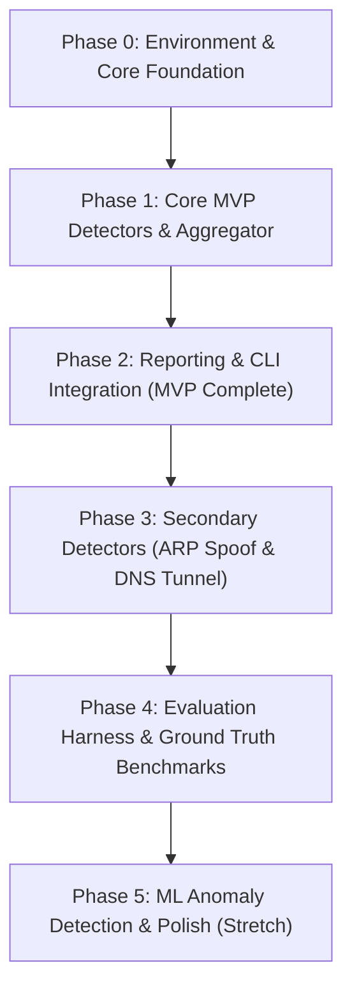

# Implementation Phases: PcapSentinel

Companion to `PRD.md` and `Architecture.md`. Defines the sequential engineering phases, objectives, deliverables, technical specifications, and exit criteria for implementing PcapSentinel.

---

## 1. High-Level Roadmap

---

## Phase 0: Project Setup & Core Streaming Engine

### Objective
Establish the project structure, configuration subsystem, data contracts, streaming reader, and packet normalizer without loading complete capture files into memory.

### Deliverables
1. **Environment & Dependency Management**:
   - Python 3.11+ environment configuration.
   - `requirements.txt` declaring dependencies: `scapy`, `pyyaml`, `scikit-learn`, `pytest`.
2. **Repository Skeleton**:
   - Create directories according to repository layout in `Architecture.md`:
     - `pcapsentinel/` (core package)
     - `pcapsentinel/detectors/`
     - `pcapsentinel/reporters/`
     - `pcapsentinel/evaluation/`
     - `pcapsentinel/ml/`
     - `configs/`
     - `tests/synthetic/`
     - `data/`
3. **Core Data Models (`pcapsentinel/models.py`)**:
   - `Severity` enum: `LOW`, `MEDIUM`, `HIGH`.
   - `PacketEvent` frozen dataclass: timestamp, IP addresses, MAC addresses, protocol, ports, TCP flag representation, packet length, and parsed application layer hints.
   - `Alert` dataclass: unique ID, detector name, severity, source/destination endpoints, timestamp window, score/confidence, human-readable summary, and structured evidence dictionary.
4. **Configuration Manager (`pcapsentinel/config.py`)**:
   - Parse and validate `configs/default.yaml`.
   - Provide override mechanics for command-line arguments.
5. **Streaming Ingestion & Normalizer**:
   - `pcapsentinel/reader.py`: Generator wrapping Scapy's `PcapReader`. Must safely trap and record malformed or corrupt packets without terminating the process.
   - `pcapsentinel/normalizer.py`: Transforms raw Scapy packets into normalized `PacketEvent` instances. Pre-parses TCP flags into normalized strings (`"S"`, `"SA"`, `"F"`, `"FPU"`, `""`) and initiates secret redaction for application-layer payloads.
6. **Detector Base Interface & Dispatch Engine**:
   - `pcapsentinel/detectors/base.py`: Abstract Base Class defining `process(ev: PacketEvent) -> list[Alert]` and `finalize() -> list[Alert]`.
   - `pcapsentinel/engine.py`: Event distribution bus across active detectors, tracking packet timestamp progression and running state TTL eviction sweeps.

### Exit Criteria (Definition of Done)
- Streaming reader successfully ingests small test pcaps and malformed mock packets without memory accumulation.
- Unit tests verify conversion of raw packets into `PacketEvent` objects with correct flag representations.

---

## Phase 1: Core MVP Detectors & Aggregator

### Objective
Implement the foundational detection logic required for the MVP: TCP port scan detection and cleartext credential extraction with redaction.

### Deliverables
1. **Port Scan Detector (`pcapsentinel/detectors/port_scan.py`)**:
   - Maintain sliding time windows of probe attempts indexed by source IP.
   - Trigger when distinct destination ports or hosts exceed `min_distinct_ports` within `window_seconds`.
   - Classify scan types based on TCP flag combinations:
     - **SYN scan**: SYN-only half-open probes.
     - **FIN scan**: FIN flag set without ACK.
     - **NULL scan**: No TCP flags asserted.
     - **Xmas scan**: FIN, PSH, and URG flags asserted simultaneously.
   - Dual-window support: fast scan window (e.g. 10s) and slow scan window (e.g. 300s).
   - Evidence collection: distinct port count, sample probed ports, rate (probes/sec), and scan classification.
2. **Cleartext Credentials Detector (`pcapsentinel/detectors/cleartext_creds.py`)**:
   - **HTTP Basic Authentication**: Detect and decode `Authorization: Basic <base64>` headers. Extract the username and immediately substitute passwords with fixed redaction mask `***REDACTED***`.
   - **FTP Session Tracking**: Inspect port 21 control sessions for `USER` and `PASS` commands. Immediately mask the credential payload.
   - Enforce mandatory redaction at parse time: passwords must never be stored in memory, `PacketEvent`, `Alert`, or output logs.
   - Assigned severity: `MEDIUM` or higher.
3. **Alert Aggregator (`pcapsentinel/aggregator.py`)**:
   - Deduplication key: `(detector, src, dst, scan_type/domain)`.
   - Merge overlapping or temporally adjacent alerts within a configured grace window.
   - Aggregate evidence and determine composite severity based on alert counts and confidence scores.

### Exit Criteria (Definition of Done)
- Unit tests pass with synthetic packet sequences:
  - Triggers SYN, FIN, NULL, and Xmas alerts on matching port-scan sequences.
  - Verifies no alerts are produced for legitimate single-destination communication or normal sessions.
  - Verifies HTTP Basic and FTP login credentials are fully masked in generated alert evidence.

---

## Phase 2: Reporting & CLI Integration (Working MVP)

### Objective
Provide command-line invocation, configuration loading, and dual-format reporting (JSON and Markdown) to produce a complete, demo-ready MVP.

### Deliverables
1. **Reporters (`pcapsentinel/reporters/`)**:
   - `json_reporter.py`: Produces structured `report.json` with capture statistics, execution metadata, malformed packet totals, and serialized alert evidence.
   - `markdown_reporter.py`: Generates human-readable `report.md` featuring:
     - Executive summary table (total packets, duration, malformed count, alert counts by severity).
     - Top offending source IP addresses.
     - Detailed per-alert breakdown with evidence tables.
     - Documented detector limitations.
2. **CLI Entry Point (`pcapsentinel/cli.py`)**:
   - Command interface: `python -m pcapsentinel analyze <capture.pcap> [--config config.yaml] [--out-dir <dir>]`.
   - Command-line argument parser allowing dynamic overrides of detection thresholds.
3. **Lab / Synthetic Test Captures**:
   - Build a suite of synthetic pcap files under `tests/synthetic/` exercising SYN scan, Xmas scan, HTTP Basic auth, and benign traffic.
4. **Documentation**:
   - Comprehensive `README.md` with installation steps, CLI usage examples, sample report snippets, and architecture overview.

### Exit Criteria (Definition of Done)
- Command `python -m pcapsentinel analyze capture.pcap` executes end-to-end, producing valid `report.json` and `report.md`.
- Benign baseline capture yields zero false positives (or explicitly documented behavior).
- Passwords remain strictly redacted across all generated reports.
- `pytest` executes and passes all test suites.

---

## Phase 3: Secondary Rule-Based Detectors

### Objective
Expand network threat detection to ARP poisoning/spoofing and DNS exfiltration/tunneling indicators.

### Deliverables
1. **ARP Spoofing Detector (`pcapsentinel/detectors/arp_spoof.py`)**:
   - Track IP-to-MAC mapping state over time with initial observation timestamps.
   - Detect IP conflicts when an IP binds to multiple MAC addresses.
   - Identify gratuitous/unsolicited ARP replies causing abrupt binding changes.
   - Incorporate `allowlist_macs` configuration to avoid false positives on legitimate redundant setups (VRRP, HSRP, CARP).
2. **DNS Tunneling Detector (`pcapsentinel/detectors/dns_tunnel.py`)**:
   - Parse DNS queries and responses (QNAME, QTYPE).
   - Implement Shannon entropy calculator for domain query strings:
     $$H = -\sum_{i=1}^{n} p(x_i) \log_2 p(x_i)$$
   - Composite anomaly scoring:
     - Subdomain label length exceeding threshold (e.g. $> 40$ chars).
     - Label Shannon entropy exceeding cutoff (e.g. $> 3.5$).
     - High volume of unique subdomains queried under a single root/parent domain.
     - Disproportionate volume of TXT or NULL record queries.
   - Incorporate `domain_allowlist` for high-entropy benign domains (CDNs, AV updates, cloud telemetry).

### Exit Criteria (Definition of Done)
- Unit tests verify ARP spoof detection on conflicting MAC mappings while respecting configured allowlists.
- DNS tunneling tests identify high-entropy synthetic subdomain probes (e.g. dnscat2 / iodine signatures) while ignoring standard web browsing traffic.

---

## Phase 4: Evaluation Harness & Ground Truth Benchmarks

### Objective
Implement an evaluation pipeline that assesses detector quality, measures precision, recall, and false-positive rates against ground-truth labeled captures, and prevents threshold overfitting.

### Deliverables
1. **Dataset Ground Truth Schema (`data/labels.yaml`)**:
   - Define declarative YAML schema mapping pcap files to expected detection records (detector type, attack classification, source IP, and timestamp intervals).
2. **Evaluation Logic (`pcapsentinel/evaluation/evaluate.py`)**:
   - Alert matching engine: A detection is classified as a True Positive (TP) if its detector type, source endpoint, and active time window intersect with a ground-truth label.
   - Unmatched generated alerts are tabulated as False Positives (FP).
   - Unmatched ground-truth records are tabulated as False Negatives (FN).
   - Compute evaluation metrics per detector:
     $$\text{Precision} = \frac{\text{TP}}{\text{TP} + \text{FP}}$$
     $$\text{Recall} = \frac{\text{TP}}{\text{TP} + \text{FN}}$$
     $$F_1\text{-score} = 2 \cdot \frac{\text{Precision} \cdot \text{Recall}}{\text{Precision} + \text{Recall}}$$
3. **Evaluation CLI Command**:
   - `python -m pcapsentinel evaluate --labels data/labels.yaml [--dataset-dir <dir>]`.
   - Render clean ASCII summary tables displaying metrics per detector.
4. **Dataset Partitioning & Limitation Documentation**:
   - Partition captures into a **Tuning Set** (for calibrating threshold constants) and a **Held-Out Test Set** (for validation).
   - Formally document known detector boundaries (e.g. low-and-slow port scans below packet-rate thresholds).

### Exit Criteria (Definition of Done)
- Running `evaluate` produces consistent, automated metrics tables across labeled datasets.
- Threshold adjustments can be measured quantitatively to prevent regressions.

---

## Phase 5: ML Anomaly Detection & Polish (Stretch Scope)

### Objective
Complement rule-based detectors with unsupervised machine learning (Isolation Forest) on windowed network flow features, and support telemetry export.

### Deliverables
1. **Feature Extraction (`pcapsentinel/ml/features.py`)**:
   - Aggregate network flow metrics per source IP over fixed time windows (e.g. 60 seconds):
     - Flow/connection counts per minute.
     - Distinct destination IP count.
     - Distinct destination port count.
     - Total SYN packets transmitted.
     - SYN-to-ACK packet ratio.
     - Bytes sent vs. bytes received ratio.
     - Mean packet length.
     - DNS query rate.
2. **Model Training & Inference (`pcapsentinel/ml/train.py`, `pcapsentinel/ml/infer.py`)**:
   - Train an `IsolationForest` estimator from `scikit-learn` on benign baseline captures.
   - Serialize model artifact using `joblib`.
   - CLI sub-command: `python -m pcapsentinel train --baseline <pcap> --output models/iforest.joblib`.
   - Inference mode: Score source windows, flag top-K anomalies, and attach contributing feature values to alert evidence.
3. **Comparative Analysis**:
   - Evaluate ML anomaly detection against rule-based detections on the same labeled benchmark dataset.
4. **Metrics Export (`pcapsentinel/reporters/metrics_exporter.py`)** *(Optional stretch)*:
   - Export detection counters in Prometheus text or Graphite format for Grafana dashboard integration.

### Exit Criteria (Definition of Done)
- Feature extraction handles variable capture windows without crashing.
- Trained model detects synthetic anomalies and outputs ranked alerts with explainable feature contributions.
- Comparative findings between ML and deterministic rules are documented.

---

## Verification & Quality Assurance Matrix

| Phase | Quality Check | Tools / Methods |
|---|---|---|
| **Phase 0** | Memory bounds & packet normalizer validation | `pytest tests/test_reader.py tests/test_normalizer.py` |
| **Phase 1** | Port scan classification & credential masking | `pytest tests/test_port_scan.py tests/test_cleartext.py` |
| **Phase 2** | End-to-end CLI runs & report generation | CLI invocation on synthetic captures; JSON schema validation |
| **Phase 3** | ARP spoofing & DNS tunneling entropy scoring | `pytest tests/test_arp_spoof.py tests/test_dns_tunnel.py` |
| **Phase 4** | Ground truth precision/recall benchmarking | `python -m pcapsentinel evaluate --labels data/labels.yaml` |
| **Phase 5** | Unsupervised flow scoring & feature attribution | Model inference evaluation against labeled baseline datasets |
